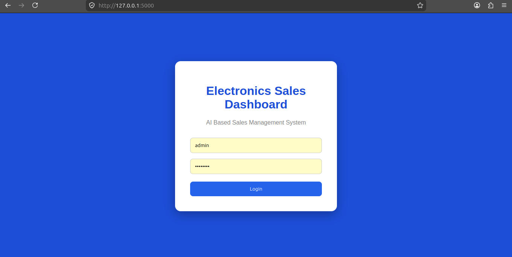
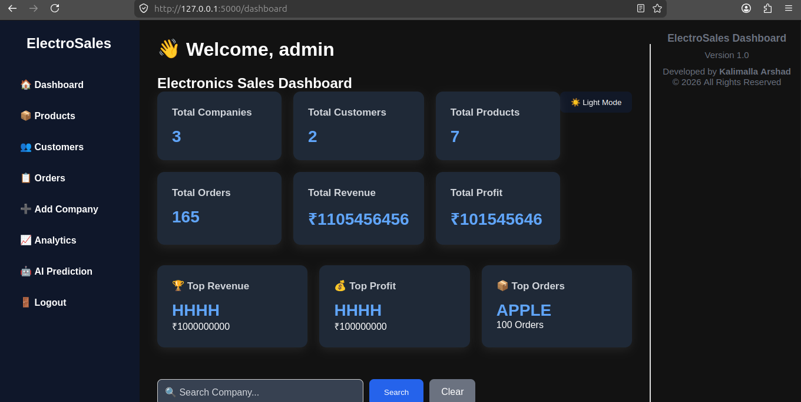
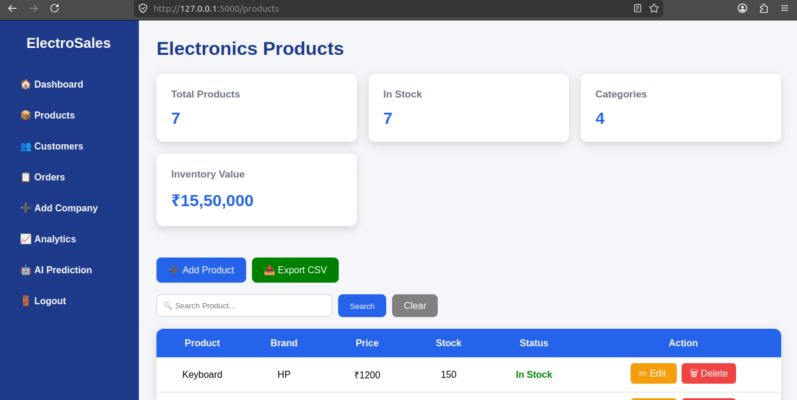
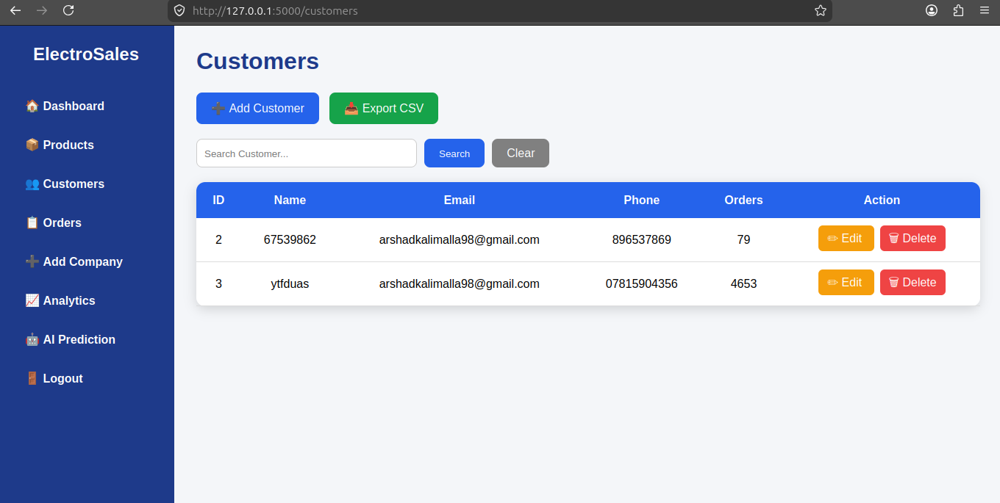
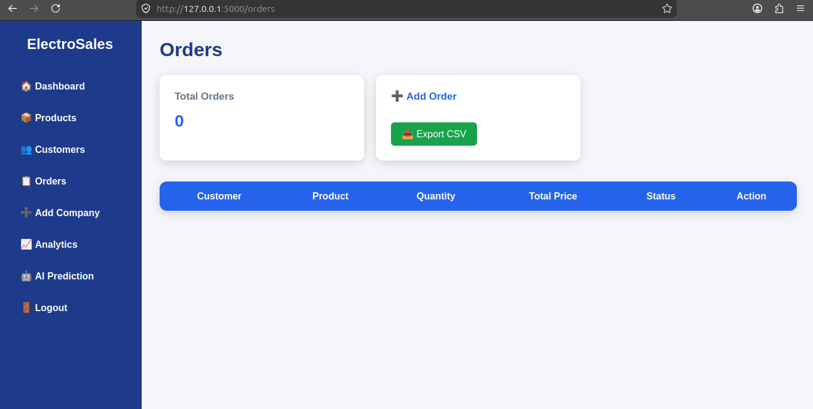
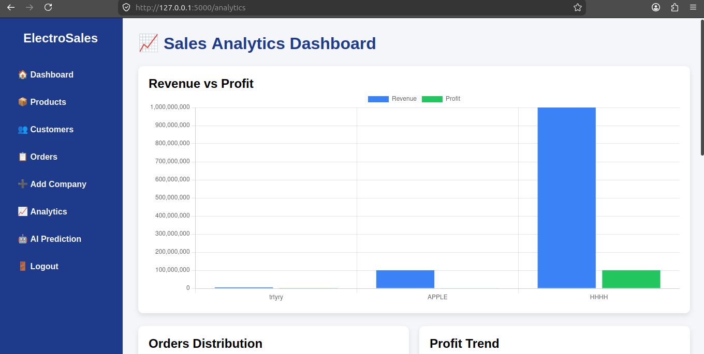
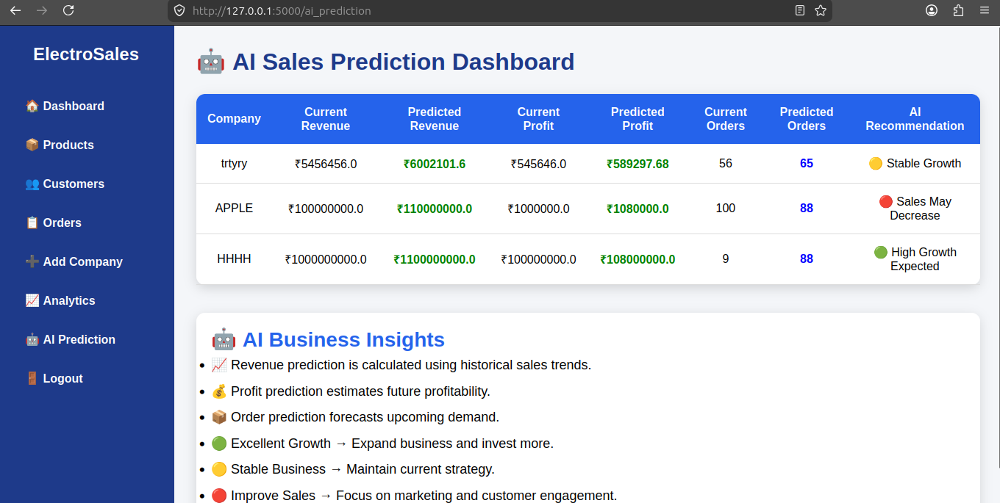
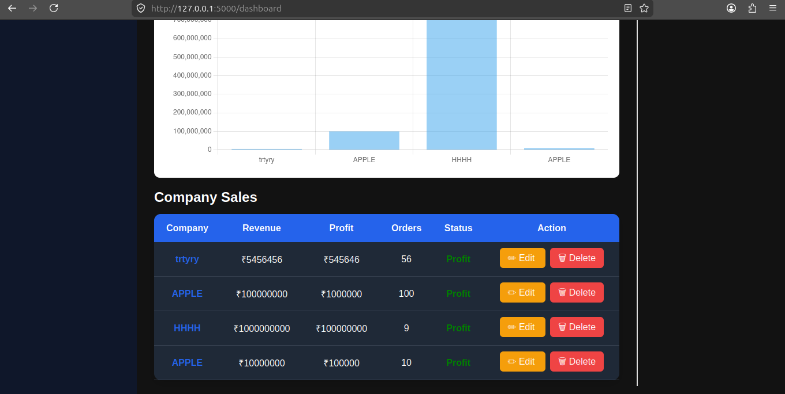

𝐄𝐥𝐞𝐜𝐭𝐫𝐨𝐧𝐢𝐜𝐬 𝐒𝐚𝐥𝐞𝐬 𝐃𝐚𝐬𝐡𝐛𝐨𝐚𝐫𝐝

An AI-powered web application developed to simplify electronics sales management through an intuitive dashboard, business analytics, and machine learning-based sales prediction. The project combines data management, visualization, and predictive analytics to help users monitor business performance and make informed decisions.


𝐏𝐫𝐨𝐣𝐞𝐜𝐭 𝐎𝐯𝐞𝐫𝐯𝐢𝐞𝐰

The Electronics Sales Dashboard is designed to provide a centralized platform for managing companies, products, customers, and sales orders. It offers real-time business insights through an interactive dashboard while integrating machine learning to forecast future sales trends.

The application was developed using Flask for the backend, SQLite for database management, and HTML, CSS, and JavaScript for the user interface. A Random Forest model is used to perform AI-based sales prediction.


𝐋𝐨𝐠𝐢𝐧 𝐏𝐚𝐠𝐞

The application begins with a secure authentication system that restricts access to authorized users. This ensures that business information is protected while providing a clean and simple user experience.



𝐃𝐚𝐬𝐡𝐛𝐨𝐚𝐫𝐝

The dashboard provides a comprehensive overview of the business through key performance indicators, including total companies, customers, products, orders, revenue, and profit. It also includes search functionality, dark mode support, and report export capabilities to improve usability.




𝐂𝐨𝐦𝐩𝐚𝐧𝐲 𝐌𝐚𝐧𝐚𝐠𝐞𝐦𝐞𝐧𝐭

The Company Management module allows users to efficiently maintain company records. Users can add new companies, edit existing information, remove outdated records, and monitor revenue, profit, and order statistics from a single interface.


𝐏𝐫𝐨𝐝𝐮𝐜𝐭 𝐌𝐚𝐧𝐚𝐠𝐞𝐦𝐞𝐧𝐭

This module provides complete control over product information. Users can manage product details, maintain inventory records, and organize available products for efficient business operations.




𝐂𝐮𝐬𝐭𝐨𝐦𝐞𝐫 𝐌𝐚𝐧𝐚𝐠𝐞𝐦𝐞𝐧𝐭

The Customer Management page enables efficient handling of customer information by allowing users to create, update, view, and remove customer records whenever required.




𝐎𝐫𝐝𝐞𝐫 𝐌𝐚𝐧𝐚𝐠𝐞𝐦𝐞𝐧𝐭

The Order Management module records customer orders and helps monitor sales activities. It provides an organized workflow for tracking transactions and managing business operations effectively.



𝐀𝐧𝐚𝐥𝐲𝐭𝐢𝐜𝐬 𝐃𝐚𝐬𝐡𝐛𝐨𝐚𝐫𝐝

The Analytics section presents business data through interactive charts and graphical reports. These visualizations help users understand revenue patterns, business growth, and overall company performance.



𝐀𝐈 𝐒𝐚𝐥𝐞𝐬 𝐏𝐫𝐞𝐝𝐢𝐜𝐭𝐢𝐨𝐧

The application integrates a Machine Learning model based on the Random Forest algorithm to predict future sales using historical business data. This feature demonstrates the integration of artificial intelligence into traditional business management systems.



𝐂𝐨𝐦𝐩𝐚𝐧𝐲 𝐃𝐞𝐭𝐚𝐢𝐥𝐬

The Company Details page displays detailed information about individual companies, including financial performance, revenue, profit, and order statistics, providing users with deeper business insights.




𝐄𝐱𝐩𝐨𝐫𝐭 𝐃𝐚𝐬𝐡𝐛𝐨𝐚𝐫𝐝 𝐑𝐞𝐩𝐨𝐫𝐭

Business reports can be exported in Excel format for documentation, record keeping, and further analysis outside the application.


𝐊𝐞𝐲 𝐅𝐞𝐚𝐭𝐮𝐫𝐞𝐬

- Secure user authentication
- Interactive business dashboard
- Company management system
- Product management
- Customer management
- Order management
- Business analytics with charts
- AI-based sales prediction using Random Forest
- Search functionality
- Dashboard report export
- Dark mode support
- Responsive user interface
  
𝐓𝐞𝐜𝐡𝐧𝐨𝐥𝐨𝐠𝐲 𝐒𝐭𝐚𝐜𝐤

Backend
- Python
- Flask

Frontend
- HTML5
- CSS3
- JavaScript

Database
- SQLite

Machine Learning
- Scikit-learn (Random Forest)

Data Processing
- OpenPyXL
- Pandas
- NumPy


𝐏𝐫𝐨𝐣𝐞𝐜𝐭 𝐒𝐭𝐫𝐮𝐜𝐭𝐮𝐫𝐞

```
ElectronicsSalesDashboard
│
├── static/
├── templates/
├── database/
├── datasets/
├── model/
├── images/
├── app.py
├── requirements.txt
└── README.md
```

Getting Started

Clone the repository:

```bash
git clone https://github.com/Arshad2k57815/ElectronicsSalesDashboard.git
```

Navigate to the project directory:

```bash
cd ElectronicsSalesDashboard
```

Install the required dependencies:

```bash
pip install -r requirements.txt
```

Run the application:

```bash
python app.py
```

The application will be available at:

```
http://127.0.0.1:5000
```

𝐅𝐮𝐭𝐮𝐫𝐞 𝐄𝐧𝐡𝐚𝐧𝐜𝐞𝐦𝐞𝐧𝐭𝐬

- Advanced sales forecasting models
- Inventory management
- Customer purchase history
- Email notifications
- Cloud database integration
- Business performance reports
- Role-based user authentication

𝐃𝐞𝐯𝐞𝐥𝐨𝐩𝐞𝐫

Kalimalla Arshad

B.Tech in Electrical and Electronics Engineering

IIIT RK Valley

𝐀𝐜𝐤𝐧𝐨𝐰𝐥𝐞𝐝𝐠𝐞𝐦𝐞𝐧𝐭𝐬

This project was developed as part of my learning journey in **Flask web development, database management, business analytics, and machine learning integration. It demonstrates how data-driven technologies can be combined to build practical business management applications.
